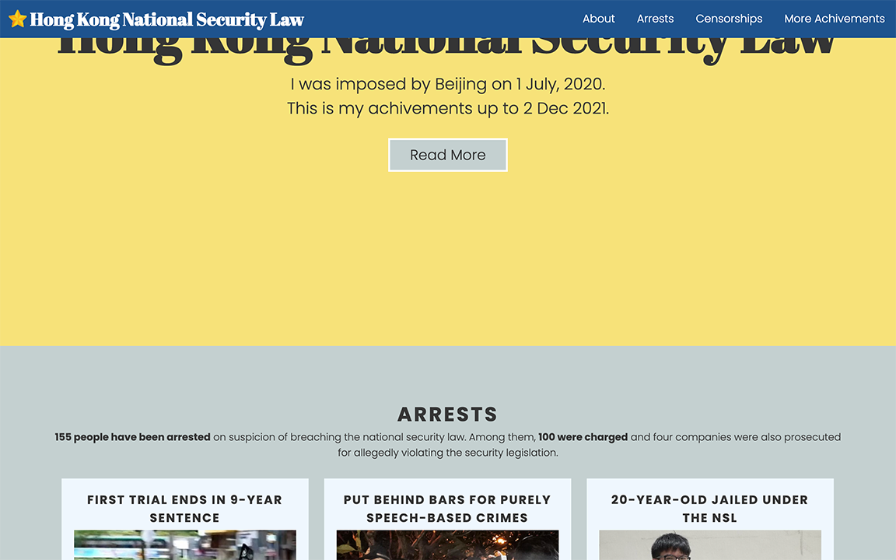
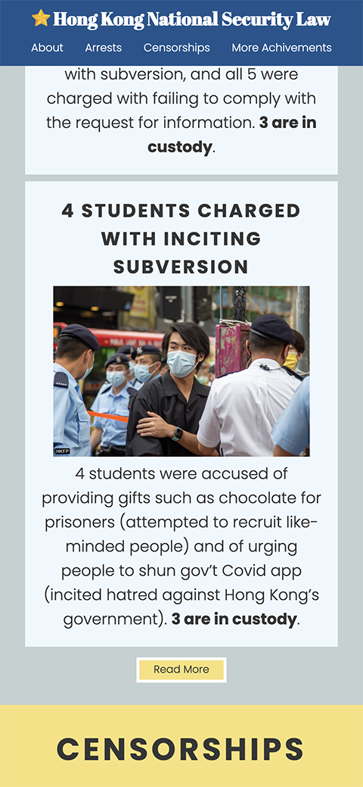

# HKNSL

A page for Hong Kong National Security Law, highlighting some of its "achievements" after Beijing has passed the law for Hong Kong on 1st July, 2020.  
This web page is one of my project for [Responsive Web Design Certification](https://www.freecodecamp.org/learn/responsive-web-design/) on [freeCodeCamp](https://www.freecodecamp.org/): [Build a Personal Portfolio Webpage](https://www.freecodecamp.org/learn/responsive-web-design/responsive-web-design-projects/build-a-personal-portfolio-webpage).

## Table of Content

- [Live Demo](#live-demo)
- [Final Product](#final-product)
- [Getting Started](#getting-started)
- [Credit](#credit)

## Live demo

This app is built on [codepen](https://codepen.io/) and exported to distribute for this live demo:  
https://scc416.github.io/hk-nsl/

## Final Product

|  |
| :--------------------------------------------: |
|           _The web page on desktop_            |

|  |
| :----------------------------------: |
|       _The web page on mobile_       |

## Getting Started

1. Clone or download this repository onto your local device.
2. Open `index.html` with browser.

## Credits
- Content and photos from [Hong Kong Free Press](https://hongkongfp.com/), [BBC](https://www.bbc.com/), [Reuters](https://www.reuters.com/).
- Favicons made by [Freepik](https://www.freepik.com) from [www.flaticon.com](https://www.flaticon.com/).